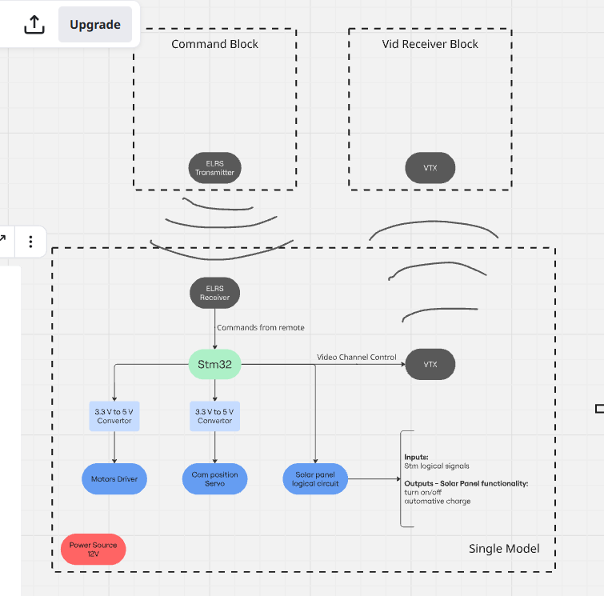
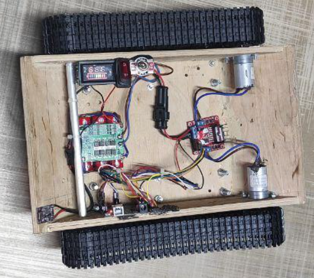

# Tracked Robotic Platform with Remote Control

A team-built tracked robotic platform with remote control, Arduino-based motor control, LoRa communication, web-based command transmission, custom electronics, and 3D-modeled mechanical parts.

The project combined embedded control logic, web control, radio communication, mechanical design, soldering, testing, and full system assembly.

## Overview

The goal of this project was to build a tracked robotic platform that could be controlled remotely using a web interface and a LoRa-based communication chain.

The control system is based on the following architecture:

```text
Web Interface → Web Server → LoRa Sender → LoRa Receiver → Arduino Controller → Motor Driver → DC Motors
```



## My Contributions

- Worked on the embedded/software control part of the platform.
- Implemented part of the control chain between the web interface, web server, LoRa modules, Arduino controller, and motor driver.
- Worked on command transmission, data reception, Arduino control logic, testing, and documentation.
- Participated in soldering, electronics integration, testing, and full system assembly.

## Key Features

- Web-based remote control
- LoRa command transmission
- Arduino-based motor control
- Separate LoRa sender and receiver logic
- Motor driver control for tracked movement
- 3D-modeled mechanical parts
- Team-based hardware and software integration

## Technologies and Tools

- Arduino
- LoRa
- Motor driver
- Web server
- HTML / CSS / JavaScript
- Python / Django
- SolidWorks
- Soldering
- Prototyping
- System testing

## Project Structure

```text
tracked-robotic-platform/
├── README.md
├── images/
│   ├── control-architecture.png
│   └── platform-photo.png
│
├── 3d-models/
│   ├── BatteryBox.SLDPRT
│   ├── BatteryBox.SLDASM
│   ├── BatteryBoxCover.SLDPRT
│   ├── Camera mount.SLDPRT
│   ├── Main suspension arm.SLDPRT
│   ├── Main body prototype sketch.SLDPRT
│   ├── Suspension sketch.SLDPRT
│   └── SkeletonExtrudedV2.SLDPRT
│
├── arduino/
│   ├── carControllers/
│   ├── loraReciever/
│   └── loraSender/
│
└── web-server/
    ├── control/
    ├── webControl/
    ├── manage.py
    └── db.sqlite3
```

## Arduino Programs

The `arduino/` folder contains three main parts:

- `carControllers/` — Arduino logic for controlling the platform motors.
- `loraSender/` — LoRa transmitter-side logic for sending control commands.
- `loraReciever/` — LoRa receiver-side logic for receiving commands and passing them to the controller.

## Web Server

The `web-server/` folder contains the web control part of the project.

It includes:

- `manage.py` — Django project management file.
- `control/` — control application logic.
- `webControl/` — web server / project configuration files.
- `db.sqlite3` — local development database, if included.

## 3D Models

The `3d-models/` folder contains SolidWorks parts and assemblies used for the mechanical design of the platform, including the battery box, camera mount, suspension parts, and body prototype elements.

## Images




## What This Project Demonstrates

This project demonstrates practical experience with robotics, embedded control, LoRa communication, web-based remote control, motor control, mechanical prototyping, hardware/software integration, soldering, testing, and team-based engineering work.

## Project Materials

Full project files, photos, diagrams, and documentation are available here:

[Open project folder](ADD_YOUR_GOOGLE_DRIVE_LINK_HERE)
